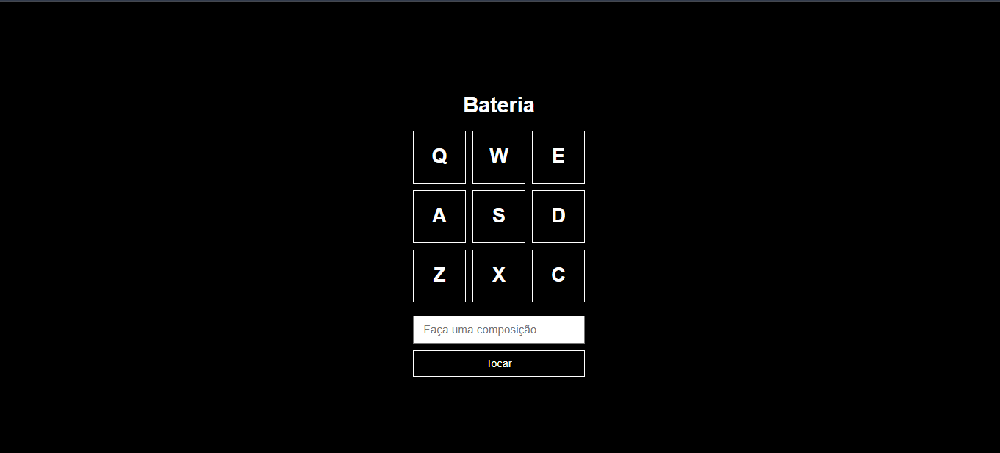

# Bateria Inteligente

Crie e toque suas próprias composições musicais com facilidade usando JavaScript, HTML e CSS. A Bateria Inteligente é um aplicativo web que permite aos usuários compor e executar músicas através de um teclado interativo.

## Visão Geral

Este projeto oferece uma plataforma simples para músicos e entusiastas experimentarem a criação musical diretamente no navegador, usando apenas algumas teclas. Com uma interface amigável e resposta sonora imediata, você pode explorar ritmos e melodias únicas.

## Recursos

- *Criação de Ritmos:* Digite comandos no teclado para formar sequências musicais.
- *Execução Automática:* Reproduza suas composições instantaneamente.

## Tecnologias

- *JavaScript:* Gerencia a lógica de interação e controle das composições.
- *HTML:* Fornece a estrutura da interface.
- *CSS:* Aplica o design visual.

## Como Começar

1. *Clone o Repositório:*
   bash
   git clone https://github.com/seu-usuario/bateria-inteligente.git
   cd bateria-inteligente
   

2. *Inicie o Projeto:*
   - Abra o arquivo index.html em um navegador.

## Instruções de Uso

- *Teclas de Comando:* Use as teclas do teclado para adicionar notas.
- *Botão "Tocar":* Clique para ouvir a composição.
- *Edição:* Ajuste e experimente diferentes sequências conforme desejar.

## Contribuições

Sinta-se à vontade para contribuir com melhorias ou novas funcionalidades.

1. *Faça um Fork:* Crie sua própria cópia do projeto.
2. *Desenvolva:* Crie uma branch para suas alterações.
3. *Pull Request:* Envie suas mudanças para revisão.
